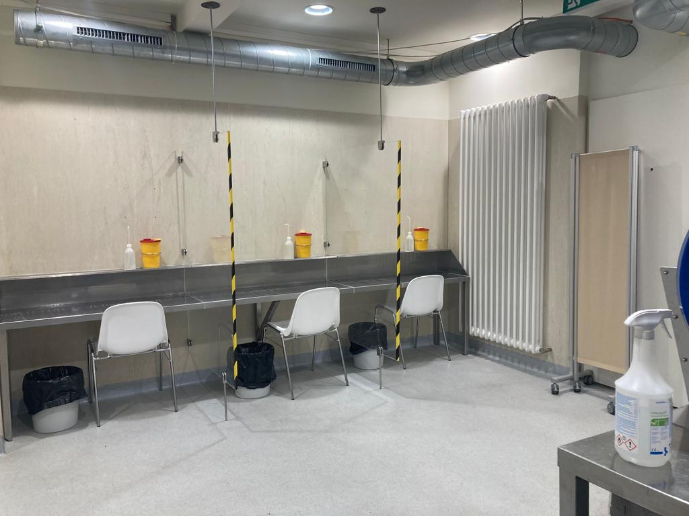
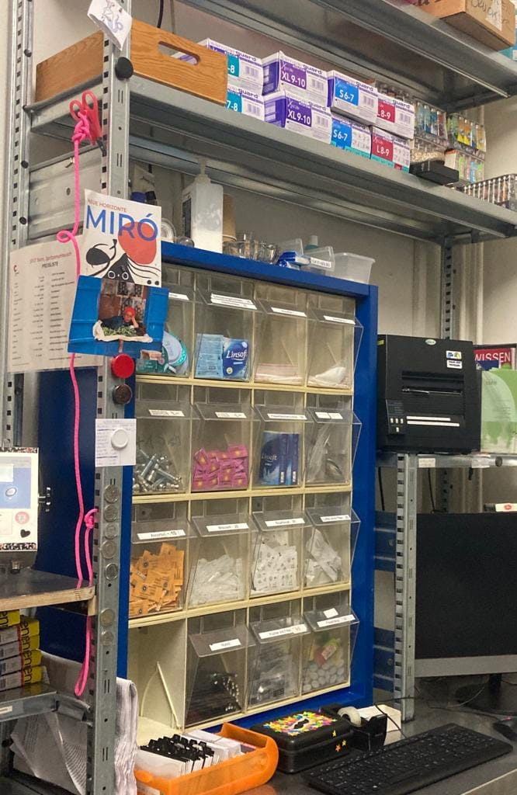

+++
title = "Die Sucht und die Menschen dahinter"
date = "2023-04-30"
draft = false
pinned = false
image = "titelbild.jpg"
+++


Drogensucht ist ein Thema, welches beschäftigt. Ein Leben, welches geprägt ist durch eine Abhängigkeit, die einem das Gefühl der Machtlosigkeit gibt. Doch was sind Gründe, die Menschen in eine Sucht abgleiten lassen? Auf der Suche nach Antworten half die Sozialarbeiterin Heidi Chalupny mit einem offenen Gespräch.



*Eine Reportage von Selina Siegenthaler und Tamira Zorn*

Ein ätzender Geruch liegt in der Luft. Grelles Licht beleuchtet einen kahlen Raum mit mehreren kleinen Tischen, die durch Scheiben abgetrennt sind. Es stehen Desinfektionsmittel und Papier zur Verfügung. Dieser Raum ist reserviert für einen sterilen und sicheren Konsum von illegalen Substanzen. Von diesen gibt es drei, einen für nasalen Konsum, der andere für intravenösen Konsum und der letzte Raum bietet Platz, um die Substanzen zu rauchen. Pro Tag kommen ca. 150 Menschen vorbei, um in einem dieser Räume sicher zu konsumieren, erzählt Heidi Chalupny, die seit ca. 14 Jahren bei «Contact Bern» arbeitet. «Contact Bern» gehört in der Schweizer Drogenpolitik zur Schadensminderung und als Anlaufstelle.

#### Innenleben und Emotionen

Mit besorgter Miene erzählt sie, dass Menschen jedes Mal, wenn sie den Fussgängerstreifen, der zum Eingang führt, überqueren, enormen Stress oder Angst verspüren. Diese negativen Gefühle entstehen durch schräge Blicke, die sie kassieren, oder durch die Furcht, gesichtet zu werden. Diese Situationen und Gefühle erleben vor allem Personen, die ein Doppelleben führen. Sie haben auf der einen Seite ein aktives Sozial- und Arbeitsleben, auf der anderen Seite führen sie ein Leben geprägt durch ihren Konsum. Diese Parallelwelten lassen sich nicht gut vereinbaren, da in der Gesellschaft keine offene Kommunikation über solche Lebenssituationen herrscht. Es kommt eine bedrückte Stimmung auf, welche ins Herz trifft. Heidi ist der Meinung, dass wir alle mehr Verständnis, Offenheit und Toleranz für Menschen in einer solchen Lage aufbringen sollten. «Diese Stigmatisierung, ich wünschte mir, die höre auf.» Voller Mitgefühl und Enttäuschung berichtet sie, welche Beleidigungen sich ihre Klient*innen anhören müssen.

> «Diese Stigmatisierung, ich wünschte mir, die höre auf.»

#### Die Auslöser zur Sucht

Da drängt sich die Frage auf, wie es so weit kommen kann, dass eine Droge diesen Platz im Leben eines Menschen einnimmt. Heidi seufzt und macht eine Pause. Da gibt es Unterschiede, von Menschen, die durch Ausprobieren hängengeblieben sind, die Droge als Medizin verwenden bis hin zu Menschen, die traumatische Erlebnisse verdrängen. Es ist schwierig, diese Frage allgemein zu beantworten, aber sie denkt, dass eine Drogensucht jeden/jede treffen kann. «Ich habe nicht das Gefühl, dass ich so ein starker Mensch bin, dass es mich nicht erwischen könnte», gibt Heidi offen zu. Betroffenheit kommt auf, als sie erzählt, dass die Ausnutzung von Frauen auf dem Strich massiv ist. Frauen sind in der Drogenszene eine Minderheitsgruppe, welche häufig von sexualisierter und physischer Gewalt betroffen sind.

> «Ich habe nicht das Gefühl, dass ich so ein starker Mensch bin, dass es mich nicht erwischen könnte.»



Laut dem ICD-11 (International Statistical Classification of Diseases and Related Health Problems) gelten Menschen als drogenabhängig, wenn mindestens zwei der folgenden Kriterien im Zeitraum von mindestens 12 Monaten auftreten. Als Kriterien gelten, einen Kontrollverlust über den Konsum zu erleben, die Droge einen immer höheren Stellenwert im Leben einnimmt und die betroffene Person immer mehr von dieser Substanz benötigten, da sie eine gewisse Toleranz entwickelt.



#### Liebe und Empathie im gemeinsamen Umgang

Es berührt, mit wieviel Liebe, Leidenschaft und Empathie Heidi über ihre Arbeit mit süchtigen Menschen spricht. Es ist spürbar, wieviel Energie und Kraft sie in ihre Arbeit steckt. Dies bestätigt auch das Funkeln in ihren Augen, als sie erklärt, dass sie sich momentan keinen anderen Job vorstellen kann. Es ist ein schöner Kontrast, sie als eine so positive Person in einem kargen Raum wahrzunehmen. Ihre warmherzige Ausstrahlung vermittelt das Gefühl von Geborgenheit, welche die Klient\*innen sicherlich schätzen. Was Heidi immer sehr berührt, sind die positiven Rückmeldungen ihrer Klient\*innen, welche sich freuen, wenn sie Schicht hat, und ihr dies persönlich mitteilen. In ihren Schichten ist sie beim selbstständigen Konsum ihrer Klient*innen dabei, unterstützt aber auch die Betroffenen in ihrem alltäglichen Leben und hat immer ein offenes Ohr. Heidi kann jedoch nur so weit helfen, wie sie sich helfen lassen wollen. Der wichtigste Schritt aus der Sucht ist die Selbstmotivation der Menschen. Sie schafft es, diesen Ort und die betroffenen Menschen in einen warmen Blickwinkel zu rücken, und dennoch den Konsum als Problem und sehr schwierige, gefährliche Situation darzustellen. Der ätzende Geruch und das grelle Licht bleiben uns noch lange in Erinnerung, und doch hat Heidi Chalupny einen neuen Blickwinkel gegenüber Betroffenen ermöglicht und es geschafft, den Menschen eine Stimme zu geben