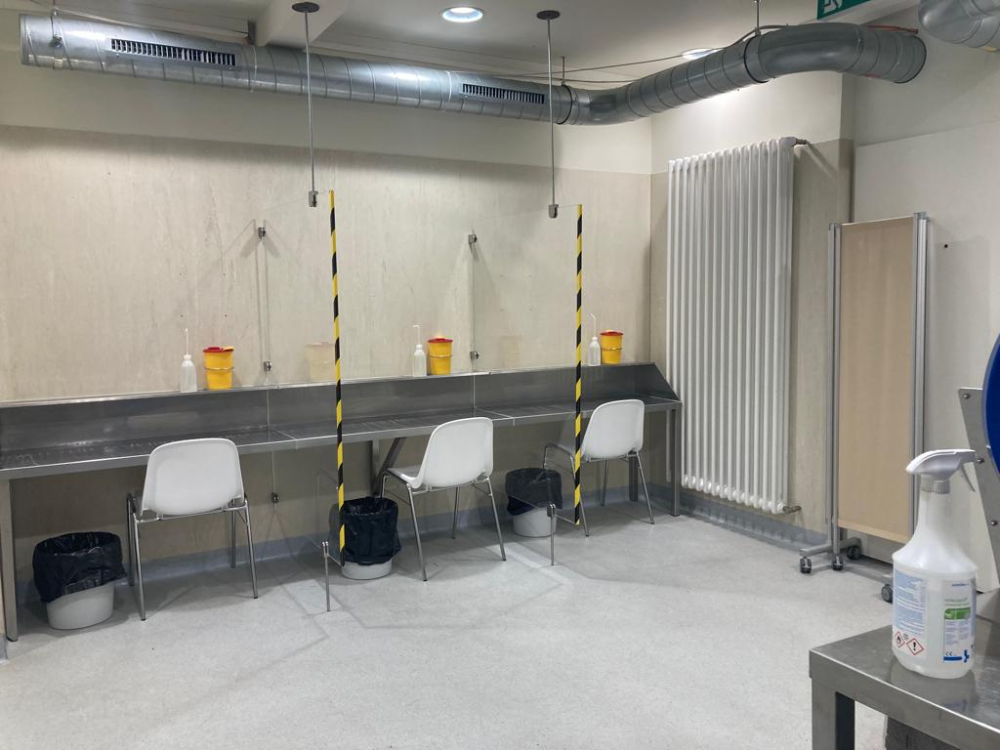
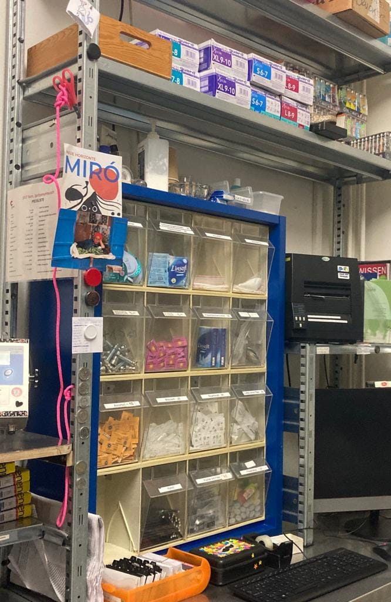

+++
title = "Ist eine Sucht die Suche nach der eigenen Identität?"
date = "2023-03-19"
draft = false
pinned = false
+++
# Ist eine Sucht die Suche nach der eigenen Identität?



Die ausgebildete Sozialarbeiterin Heidi Chalupny äussert sich zu ihrer Arbeit bei Contact Bern. Contact Bern gehört in der Drogenpolitik Schweiz zur Schadensminderung und bietet Menschen in der Drogensucht einen sicheren Konsumraum.



**Wie hat die Arbeit bei Contact deine Sicht auf legale und illegale Drogen verändert?** 

Hier haben wir vor allem mit illegalen Substanzen zu tun, welche medial stark verschrien sind. Ich habe jedoch mit anderen Beratungsstellen Kontakt, die Alkohol als Schwerpunkt haben. Diese werden überrannt von Menschen, die Unterstützung brauchen. Alkohol macht massive Probleme, körperlich als auch psychische, auch hat es grosse Auswirkungen auf das soziale Umfeld. Da frage ich mich, wie sinnvoll diese Trennung zwischen legalen und illegalen Substanzen ist. Dazu kommt, dass unabhängig welcher Substanz man nachrennt, die Sucht und der Stress gleich sind. 

**Was sind für dich die häufigsten Gründe, die Menschen in eine Sucht abgleiten lassen?**

Das ist sehr vielfältig. Zum Teil sind es Biografien, die Menschen haben, die wirklich sehr traumatisierend waren. Sei es Gewalt in der Familie, Fremdplatzierungen oder Mobbing, Ereignisse, die den Start in das Leben sehr erschwert haben und der Konsum von illegalen Substanzen ein Ausweg war, um diese Dinge zu vergessen. 

**Kann eine Sucht jeden/jede treffen?** 

Ich habe das Gefühl es kann jeden treffen! Ich habe nicht das Gefühl, dass ich so ein starker Mensch bin, dass es mich nicht erwischen könnte. Es gibt Menschen mit starken Schmerzen, die Heroin konsumieren, welches ein starkes Schmerzmedikament ist, weil ihre Schmerzen nicht auszuhalten sind. Meiner Meinung nach ist ein stabiles Umfeld eine riesige Unterstützung, dass eine Sucht nicht entsteht. Je nach Situation ist es schwierig, dem Konsum zu widerstehen, da Gruppendruck vorhanden ist. Da ist es eine Charakterfrage. 

> Ich habe nicht das Gefühl, dass ich so ein starker Mensch bin, dass es mich nicht erwischen könnte.

**Wie weit kann man einem Menschen in einer Sucht helfen?** 

Das ist schwer. Wenn eine Person nicht aufhören möchte zu konsumieren, kann man nichts machen. Die Motivation für den Schritt zu Abstinenz muss von der Person selbst kommen. Diese Selbstmotivation, ist der grösste Faktor, um etwas in ihrem Leben zu verändern. Je nach Lebenssituation, ist ein Ausstieg sehr hart. Menschen haben Schulden, keinen familiären Rückhalt und keine bestehenden Freundschaften, da diese mit dem Konsum der Person nicht mehr zurechtkamen. Die Entzüge sind harte Arbeit, aber für die meisten ist das, was nach dem Entzug kommt, viel schlimmer. Weil, je nachdem, stehst du vor dem Nichts.

 **Woran machst du Erfolge deiner Arbeit fest, und welche Ziele sind realistisch zu erreichen?** 

Man darf Erfolge nicht mit Abstinenz gleichsetzen, dann wären die Erfolgschancen bei uns gleich null. Das Problem ist, dass wir die Leute hier nur sehen, wenn sie konsumieren. Während all den Jahren, in denen ich hier arbeite, sind x Leute nicht mehr gekommen. In den meisten Fällen weiss ich nicht, weshalb sie nicht mehr kommen. Manche tauchen wieder auf und sagen, dass sie im Gefängnis waren, andere waren im Entzug und haben es nicht geschafft, wieder andere sind vielleicht sogar gestorben. Meine Erfolge sind die kleinen Sachen. Zum Beispiel wenn es Leuten sehr schlecht ging und es ihnen plötzlich wieder besser geht, da bin ich schon sehr froh. Unsere Leute kommen nicht wegen mir hierher, sie kommen wegen dem Konsum.

**Was sind die schwierigsten und was die schönsten Situationen in deiner Arbeit mit den Klienten und Klientinnen?**

Die schwierigen Augenblicke sind, wenn man jemandem zusehen muss, dem es immer schlechter geht. Das ist schwer auszuhalten, denn man hat das Gefühl, dass die Person etwas ändern sollte. Wir haben aber nicht die Autorität oder Macht- wir dürfen diesen Menschen nichts vorschreiben. Auch schwierig ist es, wenn wir sehen, dass jemand sehr krank ist und man weiss, dass diese Person nie mehr gesund wird. Also wenn es in eine Sterbebegleitung reingeht, das ist hart mitzuerleben. Das klingt jetzt alles so schwer, aber es gibt jeden Tag auch so schöne Begegnungen. Es gibt Menschen, die es cool finden, wenn ich in der Schicht bin, wenn wir reden können oder wenn wir zusammen Kaffeetrinken können, dann finden sie das grossartig. 



Heidi Chalupny ist ausgebildete Sozialarbeiterin. Seit 14.5 Jahren arbeitet sie bei «Contact Bern». Seit letztem Juni ist sie stellvertretende Betriebsleiterin. Die Arbeit bei Contact macht ihr Spass und sie kann sich momentan nichts anderes vorstellen. Vor ihrem Sozialstudium hat sie eine Ausbildung zur Pflegefachfrau gemacht. Sie hat schon früh ein Interesse für das Thema Drogen und Menschen entwickelt.



**Es scheint, als wäre Sucht immer noch ein Tabuthema in unserer Gesellschaft, wie nimmst du das wahr?** 

Süchtige Personen können den Arbeitgeber*innen nicht die Wahrheit sagen, sie sind in einer schrecklichen zwiespältigen Lebenssituation. Sie haben ein Parallelleben, auf der einen Seite hier den Konsum und auf der anderen Seite die Arbeit oder das Zuhause. Diese Menschen sind sicher in einer Tabusituation. Gleichzeitig muss man auch sagen, dass so viel konsumiert wird. Wenn man auf eine Party geht, da weiss man genau, da ist MDMA, Amphi, Kokain, plus noch Alkohol. Ich habe das Gefühl, dass Abstufungen gemacht werden: Heroin ist der Teufel, aber so Partydrogen sind ok, das finde ich dann so gemein. Nur weil jemand Heroin konsumiert, ist er nicht automatisch schlechter als alle anderen. Es können auch Menschen, die über Jahre nur auf Partys etwas gespickt oder geschnupft haben, in einer Abhängigkeit landen.

**Gibt es Unterschiede zwischen den Geschlechtern?** 

Schweizweit ist es so, dass Frauen nur ungefähr ¼ der Drogenszene ausmachen. Minderheitsgruppen haben es immer ein bisschen schwieriger. Sie sind viel mehr von Gewalt betroffen. Generell sind Frauen mehr von Gewalt betroffen als Männer, oder die Männer reden nie darüber. Das Thema Sexarbeit ist bei Frauen viel grösser und was dies mitbringt, ist sexualisierte Gewalt oder auch physische Gewalt. Frauen haben ein viel grösseres Risiko, davon betroffen zu sein. Die Ausnutzung auf dem Strich ist massiv. 

**Was würdest du uns gerne noch zu dem Thema sagen oder auf den Weg geben, wie wir als Individuen und als Gesellschaft mit der Problematik und den Betroffenen umgehen können?** 

Die Stigmatisierung, ich wünschte mir, die höre auf. Es gibt nicht nur den Drogenkonsument oder die Drogenkonsumentin. Jeder Mensch ist anders. Wer hat es schon gerne, in eine Schublade gesteckt zu werden. Die Menschen, die bei uns sind, haben die Überschneidung Drogen, aber untereinander sind sie extrem unterschiedlich. Den Strafregisterauszug, den weiss ich nicht von allen. Wenn ich es wüsste, wäre ich bei gewissen schon schockiert. Es gibt Menschen, die wirklich schlimme Sachen gemacht haben, aber im Kontakt mit mir sind sie völlig anständig. Da muss man manchmal schon bisschen unterscheiden zwischen Tat und Täter oder Tat und Täterin. Nur weil jemand ein Gewaltdelikt verübt hat, ist der Mensch nicht automatisch ein Gewalttäter oder eine Gewalttäterin… 

**Ist Sucht eine Suche nach der eigenen Identität?** 

Ich habe manchmal das Gefühl, dass Jugendliche, die auf der Suche nach sich selbst sind, viele Substanzen ausprobieren. Es gibt jedoch auch Menschen, die Drogen als Medizin brauchen. Was wir häufig haben, sind Menschen mit ADHS, die Kokain konsumieren, weil dies ein bisschen wie Ritalin wirkt. Es gibt Menschen, die konsumieren, um Traumata zu verdrängen, sie sind nicht auf der Suche nach sich selbst. Es gibt auch psychiatrische Diagnosen, wo nicht klar ist, ob die Drogenabhängigkeit oder das psychische Problem zuerst da war.

> Es gibt Menschen, die konsumieren, um Traumata zu verdrängen, sie sind nicht auf der Suche nach sich selbst.